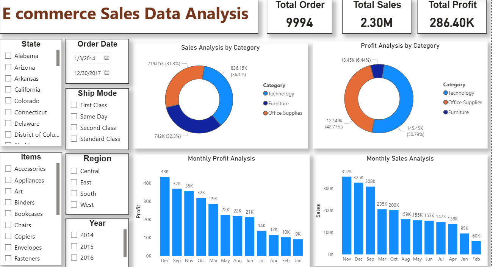

# 📊 E-Commerce Data Analysis

## 📌 Overview
This project focuses on analyzing an **E-Commerce Sales Dataset** to uncover meaningful business insights, identify sales trends, and understand customer purchasing behavior.  
The analysis is performed using **Python (Pandas, Matplotlib, Seaborn)** for data preprocessing & visualization and **Power BI** for creating interactive dashboards.

---

## 🎯 Objectives
- **Data Cleaning & Preprocessing** using Python (Pandas & NumPy)
- **Exploratory Data Analysis (EDA)** to uncover trends and patterns
- **KPI Tracking** including:
  - Total Sales
  - Total Orders
  - Average Order Value
  - Sales by Category
  - Regional Sales Performance
  - Monthly Sales Trends
- **Interactive Dashboard** development in Power BI

---

## 📂 Repository Structure
```bash
E-Commerce-Data-Analysis/
│
├── images/
│   └── dashboard.png                       # Power BI dashboard preview

├── E commerce sales Data Analysis Using Python.ipynb   # Jupyter Notebook (Python Analysis)
├── E commerce sales Data Analysis_1.pbix               # Power BI dashboard file
├── E commerce sales Dataset(Raw).csv                   # Raw dataset
├── Processed_Ecommerce_Data.csv                        # Cleaned dataset
├── LICENSE
└── README.md
```
---

## 🗂 Dataset Information
**Processed File:** `Processed_Ecommerce_Data.csv`  
**Raw File:** `E commerce sales Dataset(Raw).csv`  

**Main Columns:**
- Order ID  
- Product Name  
- Category  
- Quantity Ordered  
- Price Each  
- Order Date  

---

## 🛠 Tools & Technologies
- **Python**: Pandas, NumPy, Matplotlib, Seaborn
- **Jupyter Notebook**: Data preprocessing & visualization
- **Power BI**: Interactive dashboard creation
- **CSV Dataset**: Processed sales data

---

## 📈 Key Insights
From the analysis:
1. **Highest Sales Month** identified to help plan marketing campaigns.
2. **Top-selling products** contributing most to revenue.
3. **Geographical distribution** of customers and sales.
4. **Correlation between order quantity and revenue**.
5. Seasonal patterns and monthly sales trends.

---

## 📊 Power BI Dashboard
The Power BI dashboard provides:
- **Monthly Sales Trends**
- **Top Products by Sales**
- **Revenue by State/City**
- **Category-wise Performance**
- **Customer Order Patterns**

---

 ## 🖼 Dashboard Preview


---
## 🚀 How to Run

1. **Clone the Repository**
   ```bash
   git clone https://github.com/Subhajit75/E-Commerce-Data-Analysis.git
   cd E-Commerce-Data-Analysis
   ```
2. **Open Jupyter Notebook**

  - Run: E commerce sales Data Analysis Using Python.ipynb

3. **View Power BI Dashboard**

  - Open: E commerce sales Data Analysis_1.pbix in Power BI Desktop


---
   
## 📫 Contact
<div align="center">

[](mailto:subhajitghosh7590@gmail.com)
[](https://www.linkedin.com/in/subhajit-ghosh-75s90g/)

</div>

## 📜 License

MIT License © 2025 [Subhajit Ghosh](https://www.linkedin.com/in/subhajit-ghosh-75s90g/)

---

<div align="center">
  
Made with ❤️ by [Subhajit Ghosh](https://www.linkedin.com/in/subhajit-ghosh-75s90g/)  

</div>
