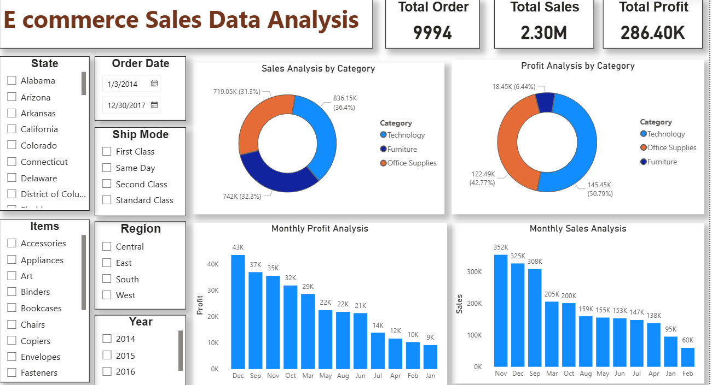

# 📊 E-Commerce Data Analysis

## 📌 Project Overview
This project focuses on analyzing an **E-Commerce Sales Dataset** to uncover meaningful business insights, identify sales trends, and understand customer purchasing behavior.  
The analysis is performed using **Python (Pandas, Matplotlib, Seaborn)** for data preprocessing & visualization and **Power BI** for creating interactive dashboards.

---

## 🎯 Objectives
- Clean and preprocess raw e-commerce sales data.
- Perform **Exploratory Data Analysis (EDA)** to understand sales trends.
- Identify **top-selling products**, **revenue-generating regions**, and **seasonal patterns**.
- Use **Power BI** for dynamic dashboards to visualize KPIs.

---

## 🗂 Dataset
**Processed File:** `Processed_Ecommerce_Data.csv`  
**Raw File:** `E commerce sales Dataset(Raw).csv`  

**Main Columns:**
- Order ID  
- Product Name  
- Category  
- Quantity Ordered  
- Price Each  
- Order Date  
- Purchase Address  
- Sales Revenue  

---

## 🛠 Tools & Technologies
- **Python**: Pandas, NumPy, Matplotlib, Seaborn
- **Jupyter Notebook**: Data preprocessing & visualization
- **Power BI**: Interactive dashboard creation
- **CSV Dataset**: Processed sales data

---

## 📈 Key Insights
From the analysis:
1. **Highest Sales Month** identified to help plan marketing campaigns.
2. **Top-selling products** contributing most to revenue.
3. **Geographical distribution** of customers and sales.
4. **Correlation between order quantity and revenue**.
5. Seasonal patterns and monthly sales trends.

---

## 📊 Power BI Dashboard
The Power BI dashboard provides:
- **Monthly Sales Trends**
- **Top Products by Sales**
- **Revenue by State/City**
- **Category-wise Performance**
- **Customer Order Patterns**

**Dashboard Preview:**

---

## 📂 Project Structure
